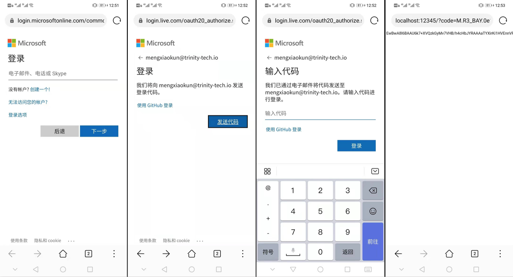

# Feeds Service 数据迁移(OneDrive)

## 1. 代码分支

​		[feat_migratedata](https://github.com/elastos-trinity/feeds-service/tree/feat_migratedata)

## 2. 测试

1. 在Android设备上运行[CarrierDemo](https://github.com/klx99/CarrierDemo.git)
2. 添加Service为Carrier好友并连接后
3. 点击菜单项[OneDriveLogin], 通过浏览器登录到OneDrive。
    
4. 登陆后返回到CarrierDemo，点击菜单项[Backup Service Data]进行数据备份。
5. 点击菜单项[Restore Service Data]进行数据恢复。
    * 未完成：恢复到了Cache文件夹，并没有去覆盖原始数据并重启Service。

