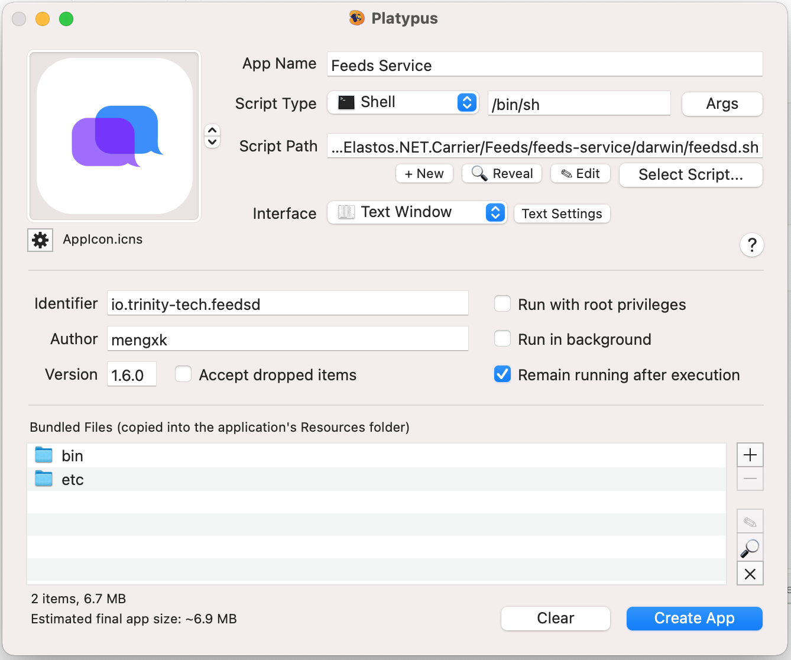

# Feeds Service 版本发布

- 1. 更新ChangeLog

- 2. 更新CMakeList.txt中的版本号

- 3. 切到master分支

- 4. 制作安装包

     1) MacOSX

     - 编译

     ```
         cd build/macosx
         cmake -DCMAKE_INSTALL_PREFIX=output ../../ (为了更新commit-id)
         make -j4
         make install
     ```

     - 制作app
     

     ```
         打开Platypus.app
         - Script Path: feeds-service/darwin/feedsd.sh
         - App Name: Feeds Service
         - AppIcon: feeds-service/darwin/AppIcon.icns
         - Identifier: io.trinity-tech.feedsd
         - Version: 1.x.x
         - Bundled files:
                bin
                etc
         - 执行[Create App]
     ```

     - 签名

     ```
        codesign -f -s "Developer ID Application: Trinity Tech Co., Ltd. (X2ZZSKA63B)"  "Feeds Service.app"
        验签: codesign -dvvv  "Feeds Service.app"
     ```

     2) Ubuntu 18.04

     - 编译

     ```
         cd build/macosx
         cmake -DCMAKE_INSTALL_PREFIX=output ../../ (为了更新commit-id)
         make -j4
     ```

     - 制作deb

     ```
         make package (生成feedsd_1.x.x_amd64.deb)
     ```

     3) Ubuntu 20.04

     - 编译

     ```
        同 Ubuntu 18.04
     ```

     - 制作deb

     ```
        同 Ubuntu 18.04
     ```

     4) Raspberry Pi

     - 编译

     ```
        同 Ubuntu 18.04
     ```

     - 制作deb

     ```
         cmake -DRASPBERRYPI=ON ../../ (更新package arch)
         make package (生成feedsd_1.x.x_armhf.deb)
     ```


- 5. 发布安装包
    参考https://github.com/elastos-trinity/feeds-service/releases已发布版本, 发布到github。
